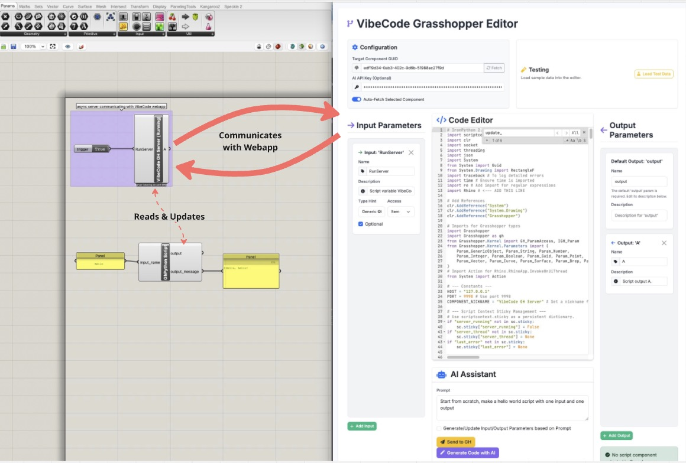
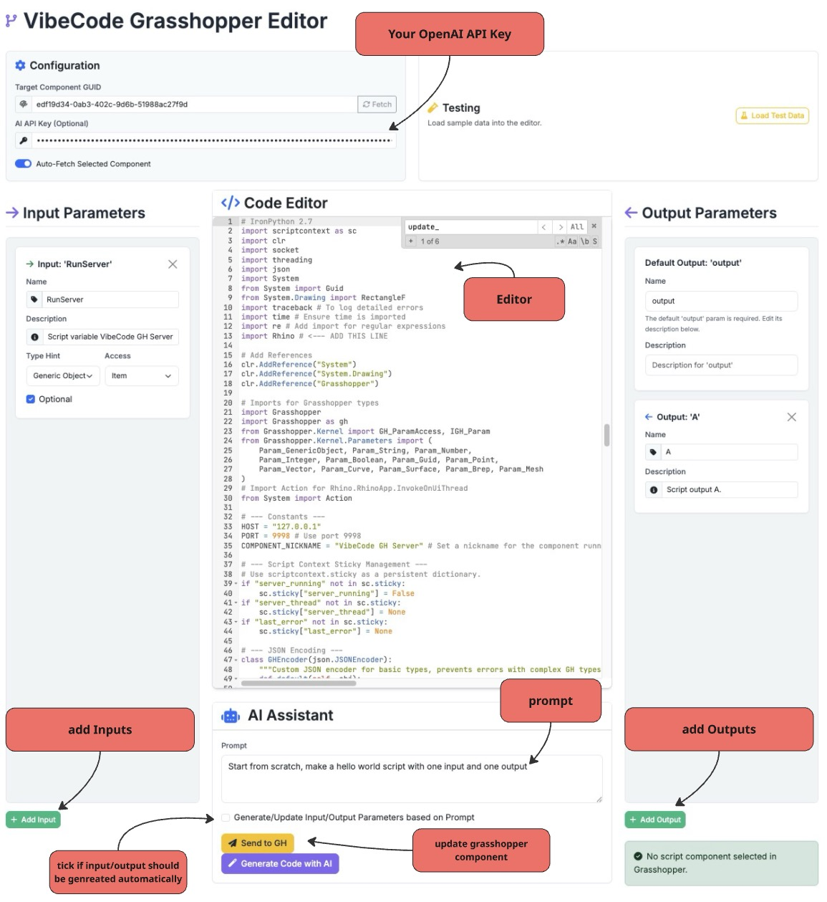

# VibeCode Grasshopper Editor

A simple web-app-like code editor for Grasshopper Python components that streamlines your workflow and enhances productivity with AI-assisted code generation.

## What is VibeCode?

VibeCode is a .. vibe coded .. interface for editing GHPython components that eliminates the frustration of working with Grasshopper's limited code editor. It provides a real-time connection between a web-based code editor and your Grasshopper canvas, making "vibe coding" easier with a more seamless AI integration -> less copy&paste.

-> its promptet to generate ironpython / python 2.7 code <-

## Key Features

- **Real-time synchronization** between the web editor and Grasshopper
- **AI-powered code generation** using your OpenAI API key
- **Add, modify, or remove** input and output parameters visually
- **Auto-fetch** selected components from your Grasshopper canvas
- **Syntax highlighting** and modern code editing features
- **Instant deployment** of changes back to Grasshopper

## Getting Started

1. **Open the Grasshopper file** with the server component (or paste the server code into a new GHPython component)
2. **Ensure the server is running** (toggle should be set to "True")
3. **Double-click** the `grasshopper_vibeCoder.html` file to open the web interface
4. **Select a script component** in Grasshopper to edit it in the web interface

## Using AI Code Generation

1. Enter your OpenAI API key in the configuration section
2. Type a prompt describing what you want to create
3. Toggle "Generate/Update Input/Output Parameters" if you want the AI to handle parameter creation
4. Click "Generate Code with AI"
5. Review and send changes back to Grasshopper with "Send to GH"

## Requirements

- Rhino 7+ with Grasshopper
- Modern web browser
- Internet connection for AI features (OpenAI API key required)
- The GHPython server must be running in your Grasshopper file

## How It Works

VibeCode establishes a local connection between your browser and Grasshopper using a custom server component. When you select a GHPython component in Grasshopper, the editor automatically fetches its code and parameters, allowing you to make changes in a modern editor interface before sending them back to Grasshopper with a single click.
