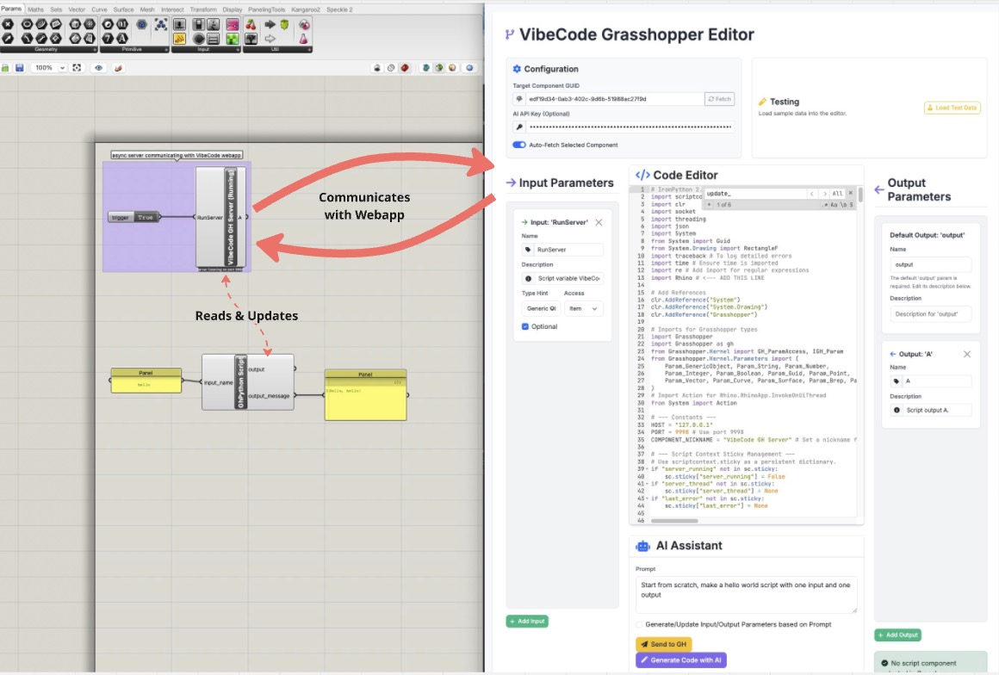
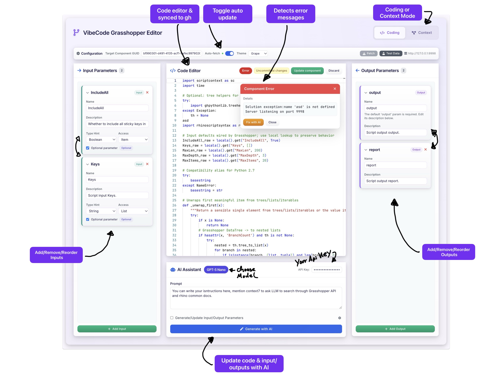
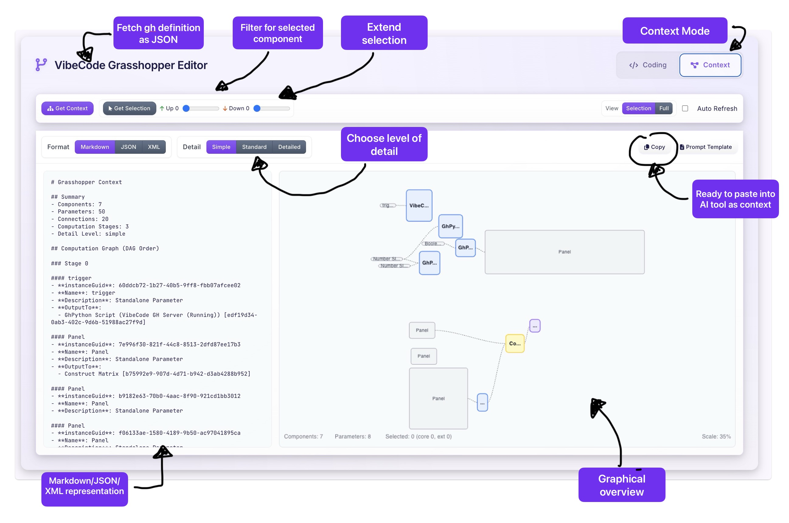

# VibeCode Grasshopper Editor

A modern web-based code editor for Grasshopper Python components that streamlines your workflow with AI-assisted code generation and intelligent context analysis.

## What is VibeCode?

VibeCode is a dual-mode interface for working with GHPython components that eliminates the frustration of Grasshopper's limited code editor. It provides real-time synchronization between a web-based editor and your Grasshopper canvas, making "vibe coding" more efficient with seamless AI integration and intelligent context understanding.

**→ Generates IronPython / Python 2.7 compatible code ←**

## Two Powerful Modes

### 🔧 **Coding Mode** - AI-Assisted Script Development
Real-time code editing with intelligent AI assistance that understands your Grasshopper definition context.

### 📋 **Context Mode** - LLM-Ready Documentation Export  
Translates your entire Grasshopper definition into LLM-friendly formats (Markdown, JSON, XML) with selectable detail levels and component filtering. Perfect for copying into external LLM tools! The output is sorted by computation order for logical flow understanding. Note: Cluster content is not parsed or scanned.

## Key Features

- **Real-time synchronization** between the web editor and Grasshopper
- **AI-powered code generation** with GPT-5 models (nano, mini, full)
- **Context-aware AI** that understands your canvas connections and component relationships
- **Add, modify, or remove** input and output parameters visually
- **Auto-fetch** selected components from your Grasshopper canvas
- **Canvas Context System** provides AI with information about connected components
- **Syntax highlighting** and modern code editing features
- **Instant deployment** of changes back to Grasshopper

## Getting Started

### Option 1: Desktop App (Recommended)
1. **Download the installer** for your OS from Releases or the `dist-electron` folder:
   - macOS (Apple Silicon): `VibeCode Grasshopper Editor-0.1.0-arm64.dmg`
   - macOS (Intel): `VibeCode Grasshopper Editor-0.1.0.dmg`
   - Windows 10/11: `VibeCode Grasshopper Editor Setup 0.1.0.exe`
   - Linux (AppImage): `VibeCode Grasshopper Editor-0.1.0.AppImage`
2. **Install and launch** VibeCode.
3. In Grasshopper, open `gh_client_snippet.gh` and set the server toggle to "True".
4. In VibeCode → Config, ensure the Grasshopper server URL is `http://localhost:9998`.
5. Select a single GHPython component in Grasshopper to start editing.

### Option 2: Run from Source (Developer Mode)
1. **Clone**: `git clone https://github.com/your-repo/grasshopper-vibe-editor.git`
2. **Install deps**: `npm install`
3. **Environment** (optional): `cp .env.example .env.local`
4. **Start Electron + Next.js dev**: `npm run electron:dev`
   - Alternatively, browser-only dev: `npm run dev` then open `http://localhost:3000`
5. In Grasshopper, open `gh_client_snippet.gh` and set server toggle to "True".

## Using AI Code Generation

1. Enter your OpenAI API key in the configuration section
2. Select your preferred model:
   - **GPT-5 Nano**: Fastest and most cost-effective ($0.05/$0.40 per 1M tokens)
   - **GPT-5 Mini**: Balanced performance ($0.25/$2.00 per 1M tokens)
   - **GPT-5**: Most capable with full context support ($1.25/$10.00 per 1M tokens)
3. Type a prompt describing what you want to create
4. Toggle "Generate/Update Input/Output Parameters" if you want the AI to handle parameter creation
5. Enable "Canvas State" context provider for AI to understand connected components
6. Click "Generate Code with AI"
7. Review and send changes back to Grasshopper with "Send to GH"

### Context System

The Canvas Context feature provides AI with intelligent information about your Grasshopper definition:
- **Automatic Detection**: Identifies components connected to your selected component (±1 level)
- **Medium Detail**: Component names, types, parameters, and connections
- **Full Detail (GPT-5)**: Includes script contents from connected components
- **Smart Filtering**: Only relevant components are included to optimize token usage
- This context helps AI generate code that properly integrates with your existing data flow

## Requirements

- Rhino 7+ with Grasshopper
- Desktop app: macOS 12+/Windows 10+ (Linux AppImage optional)
- Developer mode: Node.js 18+ (for building/running from source)
- Internet connection for AI features (OpenAI API key required)
- The GHPython server must be running in your Grasshopper file

## How It Works

VibeCode establishes a connection between your browser and Grasshopper using a custom server component. When you select a GHPython component in Grasshopper, the editor automatically fetches its code and parameters, allowing you to make changes in a modern editor interface before sending them back to Grasshopper with a single click.

## Distribution and Builds

- **Desktop builds**: `npm run dist` (or `npm run build:electron`) creates installers in `dist-electron/`.
- **Dev (Electron + Next.js)**: `npm run electron:dev`.
- **Browser-only dev**: `npm run dev` → open `http://localhost:3000`.
- Outputs are configured via `electron-builder` in `package.json`.

### Legacy web deployment (optional)
The project can still run in a browser-only environment, but the recommended way is the desktop app. If you self-host the web UI, ensure it can reach your local Grasshopper server (tunnels may be required) and point the app to that URL in Config.

## Security Notes

- API keys are stored locally in your browser (localStorage)
- The Grasshopper server only runs locally on your machine
- No tunnel is required when using the desktop app (local `http://localhost:9998`)
- Tunnel connections (ngrok/localtunnel) are only needed for remote web access
- No code or data is stored on remote servers (only in your browser session)

## Troubleshooting

### Common Issues
1. **"Failed to connect"**: Ensure `gh_client_snippet.gh` is running and the toggle is "True".
2. **"No component selected"**: Select a single GHPython component in Grasshopper.
3. **Desktop app shows blank window**: Quit and relaunch; on dev ensure port 3000 is available.
4. **macOS "app is damaged/cannot be opened"**: Open System Settings → Privacy & Security → Allow Anyway.
5. **Windows SmartScreen**: Click "More info" → "Run anyway" to proceed.
6. **AI not generating**: Verify your OpenAI API key starts with `sk-` in Config.

### Development
- **Type checking**: `npm run type-check`
- **Linting**: `npm run lint`
- **Build**: `npm run build`
