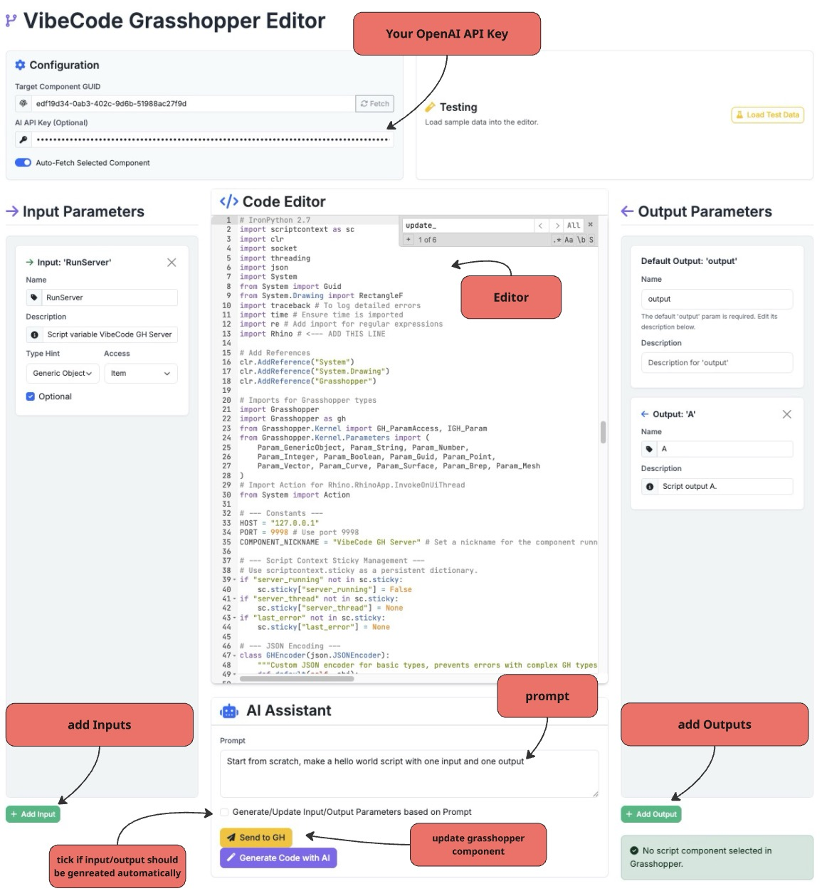

# VibeCode Grasshopper Editor

A simple web-app-like code editor for Grasshopper Python components that streamlines your workflow and enhances productivity with AI-assisted code generation.

## What is VibeCode?

VibeCode is a .. vibe coded .. interface for editing GHPython components that eliminates the frustration of working with Grasshopper's limited code editor. It provides a real-time connection between a web-based code editor and your Grasshopper canvas, making "vibe coding" easier with a more seamless AI integration -> less copy&paste.

-> its promptet to generate ironpython / python 2.7 code <-

## Key Features

- **Real-time synchronization** between the web editor and Grasshopper
- **AI-powered code generation** with GPT-5 models (nano, mini, full)
- **Context-aware AI** that understands your canvas connections and component relationships
- **Add, modify, or remove** input and output parameters visually
- **Auto-fetch** selected components from your Grasshopper canvas
- **Canvas Context System** provides AI with information about connected components
- **Syntax highlighting** and modern code editing features
- **Instant deployment** of changes back to Grasshopper

## Getting Started

### Option 1: Use the Hosted Version (Recommended)
1. Go to [**VibeCode Editor**](https://your-vercel-app.vercel.app) (hosted on Vercel)
2. **Download and install** the Grasshopper server component:
   - Download `gh_client_snippet.gh` from this repository
   - Open it in Grasshopper and ensure the server toggle is set to "True"
3. **Set up a tunnel** to connect the web app to your local Grasshopper:
   - Install [ngrok](https://ngrok.com/) or [localtunnel](https://localtunnel.me/)
   - Run: `ngrok http 9998` (or `lt --port 9998`)
   - Copy the public URL (e.g., `https://abc123.ngrok.app`)
4. **Enter the tunnel URL** in the VibeCode configuration panel
5. **Select a script component** in Grasshopper to start editing

### Option 2: Run Locally
1. **Clone this repository**: `git clone https://github.com/your-repo/grasshopper-vibe-editor.git`
2. **Install dependencies**: `npm install`
3. **Set up environment**: `cp .env.example .env.local` (and configure if needed)
4. **Run the development server**: `npm run dev`
5. **Open** [http://localhost:3000](http://localhost:3000) in your browser
6. **Set up the Grasshopper server** (same as Option 1, steps 2-5)

## Using AI Code Generation

1. Enter your OpenAI API key in the configuration section
2. Select your preferred model:
   - **GPT-5 Nano**: Fastest and most cost-effective ($0.05/$0.40 per 1M tokens)
   - **GPT-5 Mini**: Balanced performance ($0.25/$2.00 per 1M tokens)
   - **GPT-5**: Most capable with full context support ($1.25/$10.00 per 1M tokens)
3. Type a prompt describing what you want to create
4. Toggle "Generate/Update Input/Output Parameters" if you want the AI to handle parameter creation
5. Enable "Canvas State" context provider for AI to understand connected components
6. Click "Generate Code with AI"
7. Review and send changes back to Grasshopper with "Send to GH"

### Context System

The Canvas Context feature provides AI with intelligent information about your Grasshopper definition:
- **Automatic Detection**: Identifies components connected to your selected component (±1 level)
- **Medium Detail**: Component names, types, parameters, and connections
- **Full Detail (GPT-5)**: Includes script contents from connected components
- **Smart Filtering**: Only relevant components are included to optimize token usage
- This context helps AI generate code that properly integrates with your existing data flow

## Requirements

- Rhino 7+ with Grasshopper
- Modern web browser
- Internet connection for AI features (OpenAI API key required)
- The GHPython server must be running in your Grasshopper file

## How It Works

VibeCode establishes a connection between your browser and Grasshopper using a custom server component. When you select a GHPython component in Grasshopper, the editor automatically fetches its code and parameters, allowing you to make changes in a modern editor interface before sending them back to Grasshopper with a single click.

## Deployment

### Deploy to Vercel (Recommended)
1. **Fork this repository** to your GitHub account
2. **Connect to Vercel**:
   - Go to [vercel.com](https://vercel.com)
   - Import your forked repository
   - Deploy with default settings
3. **Configure environment** (optional):
   - Add environment variables in Vercel dashboard if needed
   - The app works without additional configuration

### Deploy to Other Platforms
- **Netlify**: Works out of the box with Next.js
- **Railway/Render**: Use Next.js build settings
- **Self-hosted**: Run `npm run build` then `npm run start`

## Security Notes

- API keys are stored locally in your browser (localStorage)
- The Grasshopper server only runs locally on your machine
- Tunnel connections (ngrok/localtunnel) are temporary and user-controlled
- No code or data is stored on remote servers (only in your browser session)

## Troubleshooting

### Common Issues
1. **"Failed to connect"**: Check that the Grasshopper server component toggle is "True"
2. **"No component selected"**: Select a single GHPython component in Grasshopper
3. **Tunnel not working**: Restart ngrok/localtunnel and update the URL in VibeCode
4. **AI not generating**: Verify your OpenAI API key starts with "sk-"

### Development
- **Type checking**: `npm run type-check`
- **Linting**: `npm run lint`
- **Build**: `npm run build`
